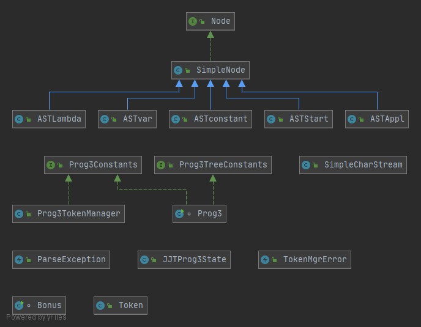
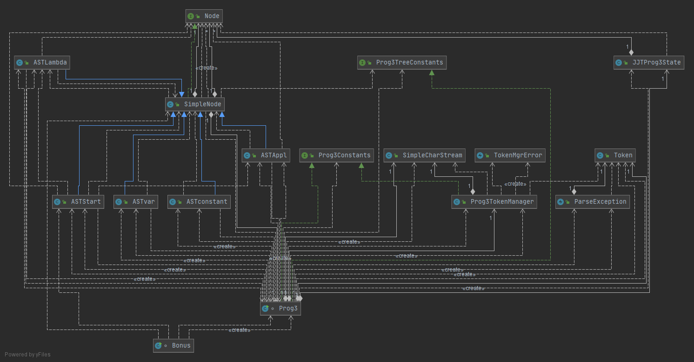
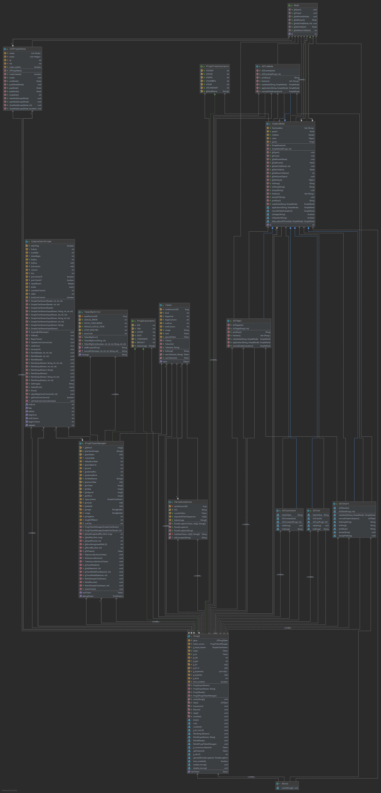

# lambda-expressions
A JJTree for lambda expressions

## Normal Order Evaluation

Normal order evaluation - the repeated application of the leftmost reducible function application. 
Reduce LEFT-most, OUTER-most redex first: evaluate all functions first before arguments. 

One of the drawbacks is that, if the arguments are themselves functions, they will not be evaluated. 
The implication is that we cannot really evaluate iteration (multiple chained promises of calculation). 

## Applicative Order Evaluation 

Applicative order evaluation - evaluate function arguments before applying the function.  

## Example inputs

Enter:     
`((L f x1 . f (f x1)) (L n . * 2 (- n 1)) 3 )`

[Link to assignment specifications](docs/Assignment3.pdf)

## UML Class Diagrams

A simplified view of the UML diagram: 

A UML diagram with dependencies

The full class diagram

## References